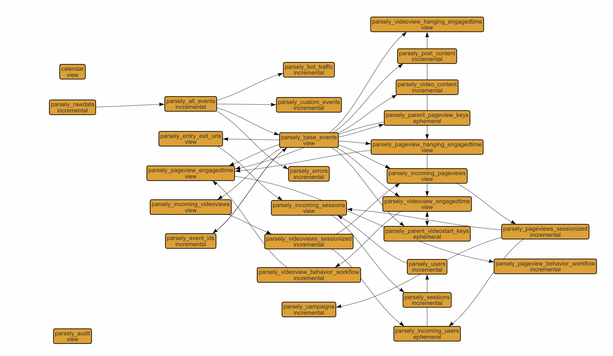

### Redshift dbt models for Parse.ly DPL

---
## Parse.ly DPL DBT
A "data-build tool" for your Parse.ly data that automates SQL table creation for your data pipeline. It creates queryable tables for things like pageviews, sessions, loyalty users, subscribers, engagement levels, read-time, and handles the incremental loading of new data from S3 to your SQL tables. By handling this setup work for you, the data-build tool reduces configuration time and lets you get started writing your own custom queries more quickly.

## Schemas/models
- *Users*
  Table Grain: 1 row per unique user ID defined by IP address and cookie. The table that provides the Parse.ly DPL lifetime engagement of a user including defining the user as Loyalty and Rolling 30 day loyalty.
- *Sessions*
  Table Grain: 1 row per user sessions. A session is defined as any activity by one user without being idle for more than 30 minutes. The session table includes total engagement and pageview metrics for the entire session as well as the user-types at the time of the session. This allows for simplified identification of conversions into loyalty users and subscribers.
- *Content*
  Table Grain: 1 row per article or video. This table contains only the most recent metadata for each article or video and aids in simplified reporting and aggregation when metadata is changed throughout the lifetime of an article.
- *Campaigns*
  Table Grain: 1 row per campaign. This table contains only the most recent description for each campaign.
- *Pageviews*
  Table Grain: 1 row per pageview. This table contains the referrer, campaign, timestamps, engaged time, and at-time-of-engagement metadata info for each pageview. The pageviews are organized to view the order and flow of pageviews within a session for one user.
- *Videoviews*
  Table Grain: 1 row per videoview. This table contains the referrer, campaign, timestamps, engaged time, and at-time-of-engagement metadata info for each video view. The videviews are organized to view the order and flow of videoviews within a session for one user.
- *Custom events*
  Table Grain: 1 row per custom event sent through the Parse.ly DPL. This is any event that is not: pageview, heartbeat, videostart, or vheartbeat. These can be specified in the dbt_project.yml file and contain keys to join to users, sessions, content, and campaigns.


## How to get started
- Install DBT
```pip install -r requirements.txt```
- Edit the following files:
 - `~/.dbt/profiles.yml`: Input Redshift cluster and database information
 - `dbt_project.yml`: Update all variables commented as configurable
 - Run `redshift_etl.py` with the arguments listed in the file. You will need your dbt-profile that you 
 specified for this connection, the s3 bucket name, and a date range to run the ETL.
 - Schedule `redshift_etl.py` to run on an automated schedule (recommended daily)

## Data model
-  This is a diagram of the entire ETL from the Parse.ly Data Pipeline rawdata to
the documented star schema in Redshift: 


---
- [What is dbt](https://dbt.readme.io/docs/overview)?
- Read the [dbt viewpoint](https://dbt.readme.io/docs/viewpoint)
- [Installation](https://dbt.readme.io/docs/installation)
- Join the [chat](http://ac-slackin.herokuapp.com/) on Slack for live questions and support.

---
